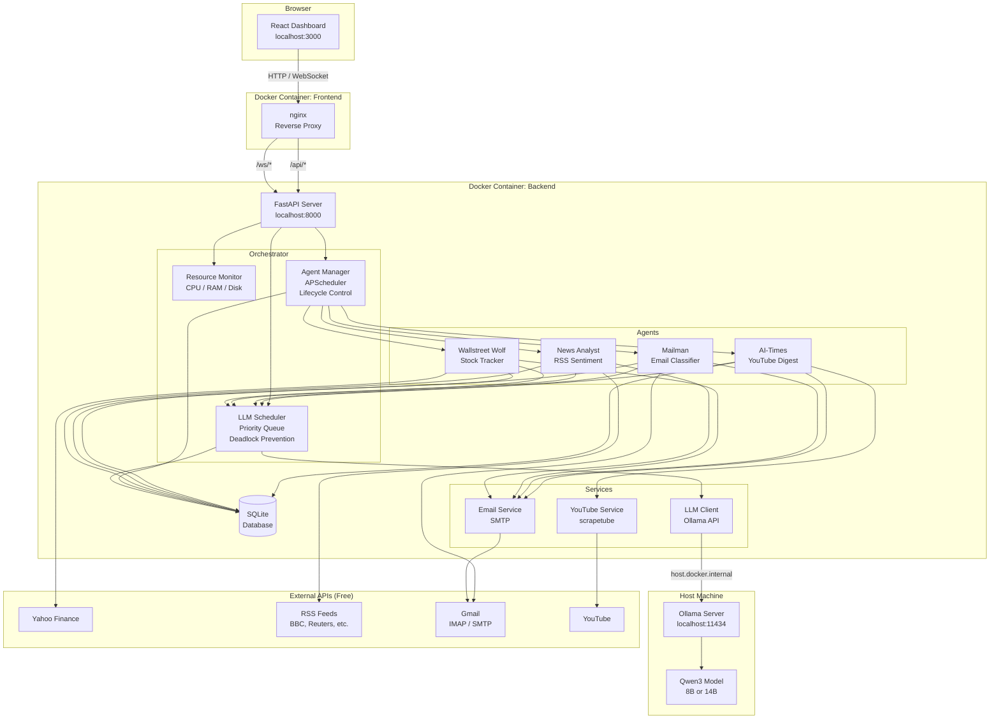
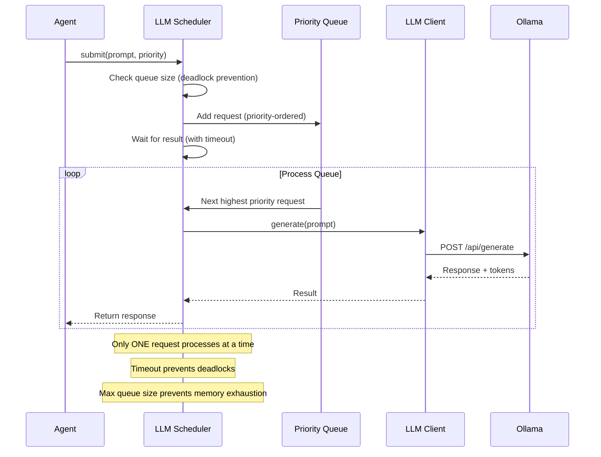
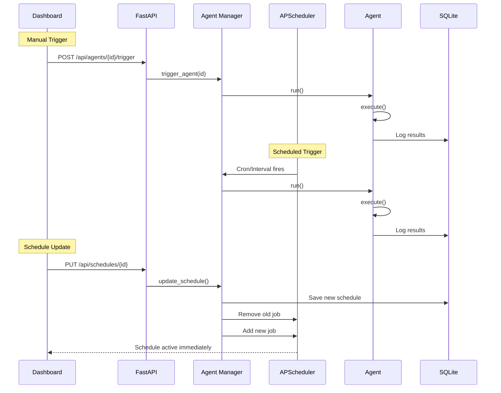

# Architecture Diagram

## System Architecture

```mermaid
graph TB
    subgraph "Browser"
        UI[React Dashboard<br/>localhost:3000]
    end

    subgraph "Docker Container: Frontend"
        NGINX[nginx<br/>Reverse Proxy]
    end

    subgraph "Docker Container: Backend"
        API[FastAPI Server<br/>localhost:8000]

        subgraph "Orchestrator"
            SCHED[LLM Scheduler<br/>Priority Queue<br/>Deadlock Prevention]
            MON[Resource Monitor<br/>CPU / RAM / Disk]
            AM[Agent Manager<br/>APScheduler<br/>Lifecycle Control]
        end

        subgraph "Agents"
            A1[AI-Times<br/>YouTube Digest]
            A2[Mailman<br/>Email Classifier]
            A3[Wallstreet Wolf<br/>Stock Tracker]
            A4[News Analyst<br/>RSS Sentiment]
        end

        subgraph "Services"
            LLM_CLIENT[LLM Client<br/>Ollama API]
            EMAIL[Email Service<br/>SMTP]
            YT[YouTube Service<br/>scrapetube]
        end

        DB[(SQLite<br/>Database)]
    end

    subgraph "Host Machine"
        OLLAMA[Ollama Server<br/>localhost:11434]
        QWEN[Qwen3 Model<br/>8B or 14B]
    end

    subgraph "External APIs (Free)"
        YAHOO[Yahoo Finance]
        RSS[RSS Feeds<br/>BBC, Reuters, etc.]
        GMAIL[Gmail<br/>IMAP / SMTP]
        YOUTUBE[YouTube]
    end

    UI -->|HTTP / WebSocket| NGINX
    NGINX -->|/api/*| API
    NGINX -->|/ws/*| API

    API --> AM
    API --> SCHED
    API --> MON

    AM --> A1
    AM --> A2
    AM --> A3
    AM --> A4

    A1 --> SCHED
    A2 --> SCHED
    A3 --> SCHED
    A4 --> SCHED

    A1 --> YT
    A1 --> EMAIL
    A2 --> EMAIL
    A3 --> EMAIL
    A4 --> EMAIL

    SCHED --> LLM_CLIENT
    LLM_CLIENT -->|host.docker.internal| OLLAMA
    OLLAMA --> QWEN

    A1 --> DB
    A2 --> DB
    A3 --> DB
    A4 --> DB
    AM --> DB
    SCHED --> DB

    YT --> YOUTUBE
    A3 --> YAHOO
    A4 --> RSS
    A2 --> GMAIL
    EMAIL --> GMAIL
```

## LLM Request Flow

```mermaid
sequenceDiagram
    participant Agent
    participant Scheduler as LLM Scheduler
    participant Queue as Priority Queue
    participant Client as LLM Client
    participant Ollama

    Agent->>Scheduler: submit(prompt, priority)
    Scheduler->>Scheduler: Check queue size (deadlock prevention)
    Scheduler->>Queue: Add request (priority-ordered)
    Scheduler->>Scheduler: Wait for result (with timeout)

    loop Process Queue
        Queue->>Scheduler: Next highest priority request
        Scheduler->>Client: generate(prompt)
        Client->>Ollama: POST /api/generate
        Ollama-->>Client: Response + tokens
        Client-->>Scheduler: Result
        Scheduler-->>Agent: Return response
    end

    Note over Scheduler: Only ONE request processes at a time
    Note over Scheduler: Timeout prevents deadlocks
    Note over Scheduler: Max queue size prevents memory exhaustion
```

## Agent Scheduling Flow

```mermaid
sequenceDiagram
    participant Dashboard
    participant API as FastAPI
    participant AM as Agent Manager
    participant APS as APScheduler
    participant Agent
    participant DB as SQLite

    Note over Dashboard: Manual Trigger
    Dashboard->>API: POST /api/agents/{id}/trigger
    API->>AM: trigger_agent(id)
    AM->>Agent: run()
    Agent->>Agent: execute()
    Agent->>DB: Log results

    Note over APS: Scheduled Trigger
    APS->>AM: Cron/Interval fires
    AM->>Agent: run()
    Agent->>Agent: execute()
    Agent->>DB: Log results

    Note over Dashboard: Schedule Update
    Dashboard->>API: PUT /api/schedules/{id}
    API->>AM: update_schedule()
    AM->>DB: Save new schedule
    AM->>APS: Remove old job
    AM->>APS: Add new job
    APS-->>Dashboard: Schedule active immediately
```
