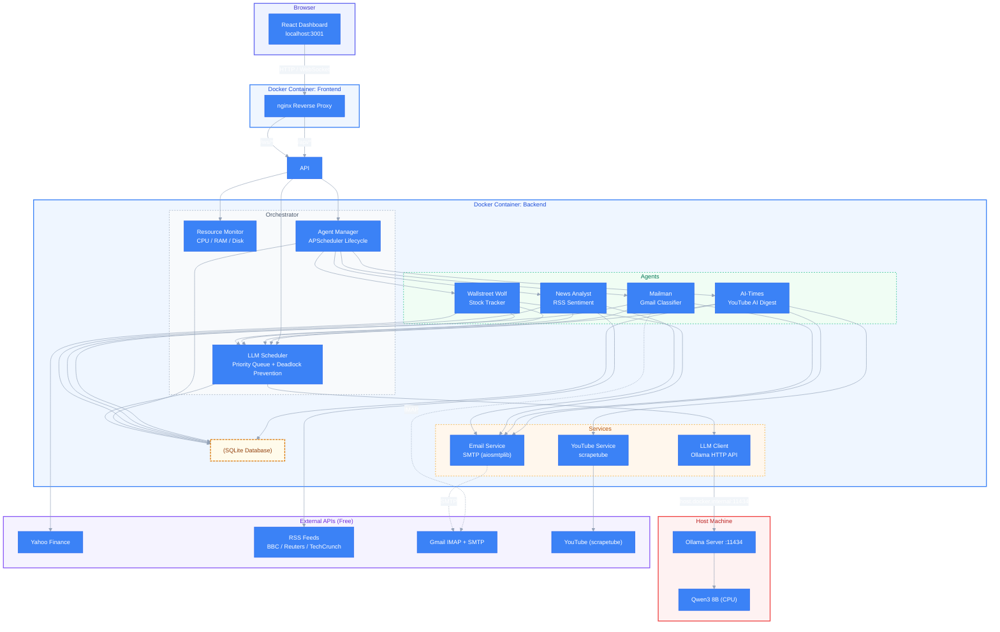
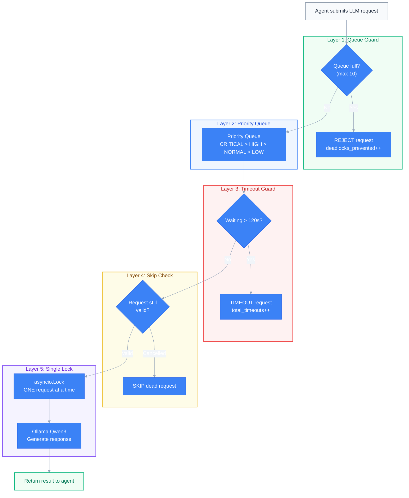
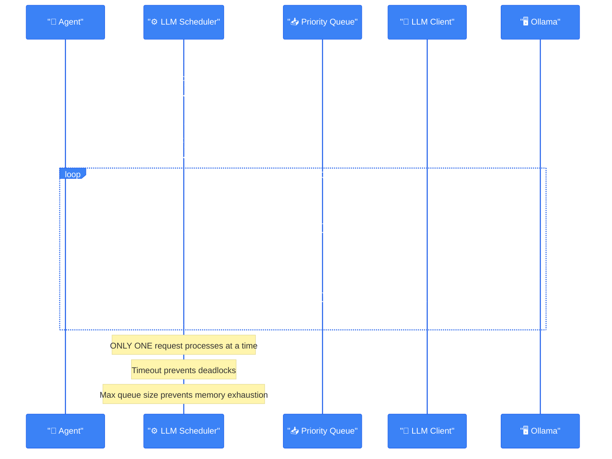
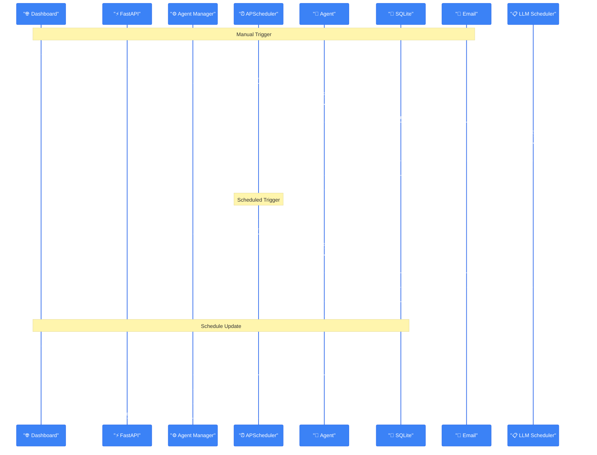

# Architecture Diagrams

## System Architecture

## Deadlock Prevention Architecture

### Deadlock Prevention Mechanisms

| Layer | Mechanism | What It Prevents | Config |
|-------|-----------|-----------------|--------|
| 1 | **Max Queue Size** | Memory exhaustion from unbounded queue | `LLM_MAX_QUEUE_SIZE=10` |
| 2 | **Priority Ordering** | Starvation of critical tasks | `RequestPriority.HIGH` for Mailman |
| 3 | **Request Timeout** | Infinite blocking when LLM hangs | `LLM_REQUEST_TIMEOUT=120` seconds |
| 4 | **Skip Dead Requests** | Stale entries clogging the queue | Automatic in worker loop |
| 5 | **Single-Lock Processing** | Race conditions on LLM access | `asyncio.Lock` in scheduler |

All metrics are tracked and exposed via `/api/llm/status`:
- `deadlocks_prevented` — Total times Layer 1 or Layer 3 fired
- `total_timeouts` — Total timed-out requests
- `total_processed` — Successfully completed requests
- `total_failed` — Requests that errored during LLM inference
- `avg_latency_seconds` — Average time per LLM request

---

## LLM Request Flow

## Agent Scheduling Flow

